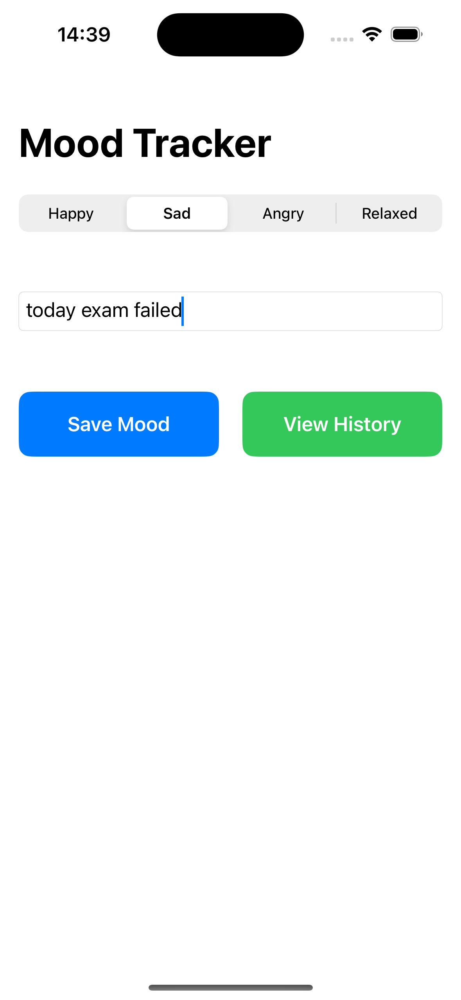
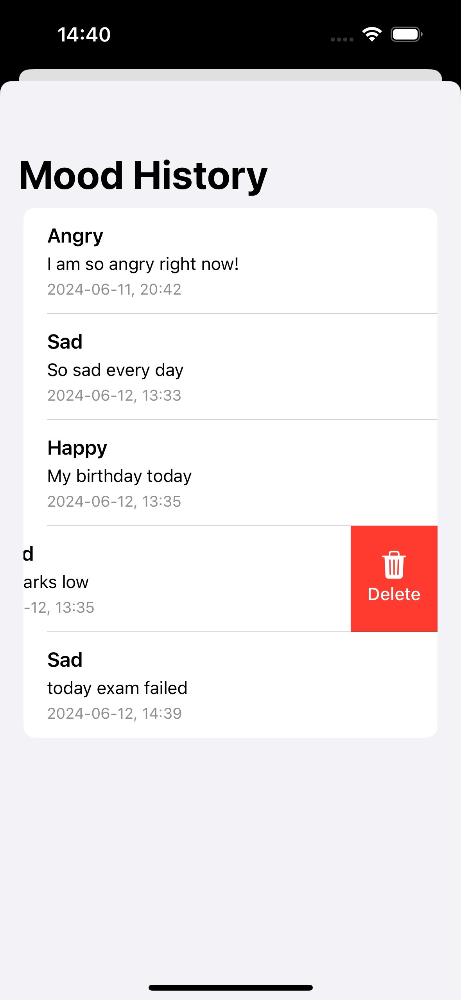

Please go under edit and edit this file as needed for your project.  There is no seperate documentation needed.

# Project Name - MoodTracker
# Student Id - IT20659158
# Student Name - M.A.H.R.Nanayakkara

#### 01. Brief Description of Project - 
Mood Tracker app's goal is to give users a simple method for categorizing their moods based on text input. In order to assist users better understand their emotional state, the app makes use of a machine learning model to assess user input and anticipate the user's present mood. This software may be used as a personal mood tracker to promote self-awareness and mental health awareness.

#### 02. Users of the System - 
The target users are individuals looking to monitor their emotional well-being, including those interested in mental health, self-improvement, or anyone who enjoys journaling and tracking their daily moods.

#### 03. What is unique about your solution -
- Integration of Machine Learning for Mood Prediction:
The app leverages a CoreML model specifically trained to analyze text and predict mood. This integration of machine learning for emotional analysis is relatively unique in the context of personal mood tracking apps, providing users with a sophisticated tool for understanding their emotions.

- User-Centric Design:
The app focuses on providing a simple, intuitive user interface that caters to the user's need for quick and easy mood tracking. The combination of SwiftUI components like text fields, sliders, and pickers enhances user experience and makes mood tracking a seamless process.

- Data Persistence and History Tracking:
The app uses Core Data for local data storage, allowing users to save and review their mood entries over time. This feature enables users to track their emotional patterns and identify trends, contributing to long-term mental health awareness and self-reflection.

- Real-Time Mood Prediction:
Unlike traditional mood tracking apps that rely on manual input and subjective self-assessment, this app offers real-time mood prediction based on the user’s text input. This immediate feedback can help users gain insights into their emotions as they occur, rather than after-the-fact reflection.

- Professional and Visually Appealing UI:
The app follows best practices in mobile app design, ensuring a professional and visually appealing user interface. The use of responsive layouts, appropriate color schemes, and typography enhances the overall user experience.


#### 04. Briefly document the functionality of the screens you have (Include screen shots of images)
- The first screen is used to track the mood. The user can enter a note on any of his/her thaughts. This note will be then fed into a mood classfier model which will output user's sentiment. According to the sentiment the top tab which is a mood pciker will select the mood accordingly. This entry with the note and the classified mood can be saved to the apllication.By using "View History" button user can navigate to the MoodHistoryView screen.

 


- The second screen that will display all the saved history records. Each will contain the note entered byt he user and the mood classified by the model. User can swipe left on a given history record to delete a given record.

 


#### 05. Give examples of best practices used when writing code
01. Code Organization and Modularization

- Keeping the code organized and modular makes it easier to maintain, debug, and extend.
- Separating concerns by using distinct classes and methods for different functionalities (e.g., model loading, prediction, UI management).

```
  class MoodPredictionService {
    private let model: MoodClassifier
    
    init() {
        guard let model = try? MoodClassifier(configuration: .init()) else {
            fatalError("Failed to load CoreML model.")
        }
        self.model = model
    }
    
    func predictMood(from text: String) -> String? {
        do {
            let input = MoodClassifierInput(text: text)
            let prediction = try model.prediction(input: input)
            return prediction.label
        } catch {
            print("Prediction error: \(error)")
            return nil
        }
    }
}
```

02. Error Handling

- Ensuring the app doesn't crash and provides meaningful feedback helps improve user experience and makes debugging easier.

```
func predictMood(from text: String) -> String? {
    do {
        let input = MoodClassifierInput(text: text)
        let prediction = try model.prediction(input: input)
        return prediction.label
    } catch {
        print("Prediction error: \(error)")
        return nil
    }
}
```

03. Using Descriptive Names

- Naming variables, methods, and classes with clear and descriptive names.
- This makes the code self-documenting and easier to understand for anyone reading it.

```
class MoodPredictionService {
    // ...
}

func predictMood(from text: String) {
    // ...
}

var selectedMood: String?
```

04. Following SwiftUI Best Practices

- Proper state management is crucial for building reactive and maintainable SwiftUI applications.
- Using @State, @Binding, and @ObservedObject appropriately to manage state and data flow in SwiftUI.

```
struct ContentView: View {
    @Environment(\.managedObjectContext) private var viewContext
    @State private var selectedMood = "Happy"
    @State private var note = ""
    @State private var isShowingHistory = false
    
    //
}
```

05. Separation of Concerns

- Using separate methods and classes for different tasks (e.g., separating the UI logic from the prediction logic).
- This makes the codebase cleaner and more maintainable.

```
struct ContentView: View {
    @State private var userInput: String = ""
    @State private var moodPrediction: String?
    
    var body: some View {
        //
    }
    
    private func predictMood() {
      //
    }
}
```

06. Testing

- Writing unit tests to verify the functionality of the prediction service.
- Ensuring the code works as expected and is free of bugs.

```
import XCTest
@testable import MoodClassifierApp

class MoodPredictionServiceTests: XCTestCase {
    func testPredictMood() {
        let service = MoodPredictionService()
        let result = service.predictMood(from: "I am feeling happy today!")
        XCTAssertNotNil(result)
        XCTAssertEqual(result, "Happy")  
    }
}

```


#### 06. UI Components used

The following components were used in the MoodTracker App, NavigationView, NavigationLink, TextField, Button, Label, Picker, List, VStack, HStack, Alert, Spacer.

#### 07. Testing carried out

- MoodTrackerTests 
```
import XCTest
@testable import MoodTracker

final class MoodTrackerTests: XCTestCase {
    
    var moodService: MoodPredictionService!

    override func setUpWithError() throws {
        moodService = MoodPredictionService()
    }

    override func tearDownWithError() throws {
        moodService = nil
    }
    
    func testPredictMoodHappy() throws {
        let moodText = "I am feeling great today!"
        let prediction = moodService.predictMood(from: moodText)
        XCTAssertEqual(prediction, "Happy", "Expected mood to be Happy")
    }

    func testPredictMoodSad() throws {
        let moodText = "This is the worst day ever"
        let prediction = moodService.predictMood(from: moodText)
        XCTAssertEqual(prediction, "Sad", "Expected mood to be Sad")
    }

    func testPredictMoodAngry() throws {
        let moodText = "I am so angry right now!"
        let prediction = moodService.predictMood(from: moodText)
        XCTAssertEqual(prediction, "Angry", "Expected mood to be Angry")
    }

    func testPredictMoodRelaxed() throws {
        let moodText = "I feel so relaxed and calm."
        let prediction = moodService.predictMood(from: moodText)
        XCTAssertEqual(prediction, "Relaxed", "Expected mood to be Relaxed")
    }

}
```

- MoodTrackerUITests
```
import XCTest

final class MoodTrackerUITests: XCTestCase {

    var app: XCUIApplication!

    override func setUpWithError() throws {
        continueAfterFailure = false
        app = XCUIApplication()
        app.launch()
    }

    override func tearDownWithError() throws {
        app = nil
    }

    func testMoodPredictionFlow() throws {
        let textField = app.textFields["Enter your thoughts..."]
        XCTAssertTrue(textField.exists)
        
        textField.tap()
        textField.typeText("I am feeling great today!")
        
        let predictButton = app.buttons["Predict Mood"]
        XCTAssertTrue(predictButton.exists)
        
        predictButton.tap()
        
        let predictedMoodLabel = app.staticTexts["Predicted Mood: Happy"]
        XCTAssertTrue(predictedMoodLabel.waitForExistence(timeout: 5), "Expected to see 'Predicted Mood: Happy'")
    }

    func testNavigateToHistoryView() throws {
        let viewHistoryButton = app.buttons["View Mood History"]
        XCTAssertTrue(viewHistoryButton.exists)
        
        viewHistoryButton.tap()
        
        let historyView = app.navigationBars["Mood History"]
        XCTAssertTrue(historyView.exists, "Expected to navigate to Mood History view")
    }
    
    func testSaveMoodEntry() throws {
        let textField = app.textFields["Enter your thoughts..."]
        XCTAssertTrue(textField.exists)
        
        textField.tap()
        textField.typeText("I am feeling happy today!")
        
        let predictButton = app.buttons["Predict Mood"]
        XCTAssertTrue(predictButton.exists)
        
        predictButton.tap()
        
        let viewHistoryButton = app.buttons["View Mood History"]
        XCTAssertTrue(viewHistoryButton.exists)
        
        viewHistoryButton.tap()
        
        let moodEntryCell = app.staticTexts["I am feeling happy today!"]
        XCTAssertTrue(moodEntryCell.waitForExistence(timeout: 5), "Expected to see the mood entry in history view")
    }
}

```


#### 08. Documentation 

(a) Design Choices

01. Core ML Integration:
- MoodClassifier.model is used to predict the mood based on user input.

02. Core Data Integration:
- Core Data is used to store user entries and predictions, allowing users to access their mood history even after closing the app.
- A MoodEntry is created with attributes for date:Date, mood:String, and note:String to store the mood data effectively.

03. User Interface Design:
- Simplicity and Clarity: The UI is designed to be simple and user-friendly. The main screen features a text field for user input and a button to predict the mood, ensuring that users can easily understand and interact with the app.
- Navigation: Utilizes a NavigationView for smooth transitions between the main screen and the history view. This provides a clear and intuitive navigation structure.
- Accessibility: Accessibility identifiers are added to key UI elements to support UI testing and ensure that the app is usable by people with disabilities.
- Responsive Layout: Uses VStack, HStack, and Spacer to create a responsive layout that adjusts to different screen sizes and orientations.


(b) Implementation Decisions

01. Architecture:
- Model-View-Controller (MVC): The app follows the MVC architecture where the MoodPredictionService acts as the model, ContentView and HistoryView are the views, and the controllers are implicit within the SwiftUI views managing state and actions.

02. Core ML Integration:
- VNCoreMLModel: The Core ML model is wrapped in a VNCoreMLModel to handle text input for mood prediction. This allows easy integration and utilization of the model within the app.
- Error Handling: Proper error handling is implemented to manage cases where the model fails to load or predict, ensuring the app does not crash.

03. Core Data Integration:
- PersistenceController: A singleton PersistenceController is implemented to manage the Core Data stack, ensuring a single point of truth for data persistence throughout the app.
- Fetch Requests: @FetchRequest is used in HistoryView to retrieve and display saved mood entries.

04. UI Components:
- SwiftUI Components: Standard SwiftUI components like TextField, Button, NavigationLink, and List are used to build the user interface. These components provide a declarative syntax that simplifies UI development and maintenance.

(c) Challenges

01. Core ML Integration:
- Model Compatibility: Initially faced issues with integrating the Core ML model, such as ensuring the model accepts text input instead of an image. This required verifying the model's input features and adjusting the implementation accordingly.
- Error Handling: Handling errors gracefully when the model fails to load or predict was crucial. Implemented robust error handling to provide meaningful feedback to the user and prevent app crashes.

02. Core Data Integration:
- Data Model Design: Designing the data model to effectively store and retrieve mood entries was challenging. Ensured the Mood entity was properly set up with the necessary attributes and relationships.
- Fetch Requests: Efficiently fetching and displaying data from Core Data in the HistoryView required a good understanding of @FetchRequest and its integration with SwiftUI.

03. UI Design and Testing:
- Accessibility: Ensuring all UI elements had appropriate accessibility identifiers for testing purposes was essential. This helped in creating reliable UI tests that could interact with the app elements correctly.
- UI Consistency: Maintaining a consistent and responsive UI across different screen sizes and orientations required careful use of SwiftUI layout components like VStack, HStack, and Spacer.

04. General Development:
- SwiftUI Learning Curve: Transitioning to SwiftUI and understanding its declarative syntax and state management was initially challenging but ultimately led to more efficient UI development.
- Testing: Writing comprehensive unit and UI tests to cover different scenarios and ensure the app's functionality was time-consuming but necessary for delivering a robust application.

#### 09. Reflection

Time management and adding new features to the system through researching

  

